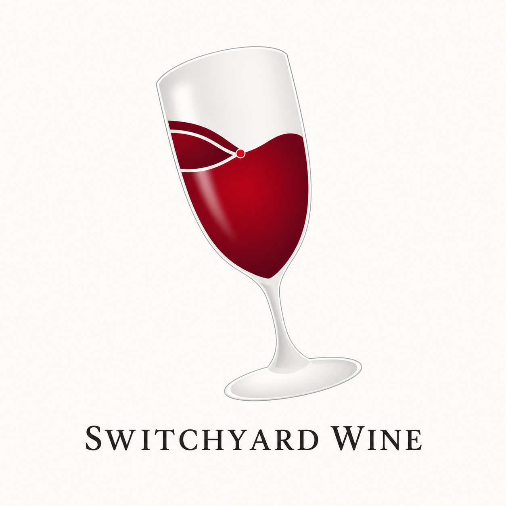

<p align="center">
  
</p>

# Switchyard Wine

Switchyard Wine is the public downstream Wine source used by the Switchyard macOS compatibility manager for Windows games and their launchers on Apple Silicon.

This repository keeps each Switchyard compatibility change as a reviewable commit on top of a pinned WineHQ revision. It also contains the local runtime builder and the provenance required to reproduce a matching runtime.

Switchyard Wine is an independent downstream project. It is not affiliated with or endorsed by WineHQ, Apple, Valve, Epic Games, GOG, Blizzard Entertainment, Google, or Microsoft.

## Why Switchyard Wine

Switchyard Wine grew out of the repeated friction of running Windows games on macOS. Installing Wine was rarely the end of the setup: users might need launcher-specific workarounds such as `--disable-gpu`, while storefronts such as Steam or Battle.net could fail before the game itself started. Earlier experience with Wine on Linux exposed the same pattern in another form, with users expected to find a suitable Wine version for each game and install fonts or other runtime pieces by hand.

Switchyard moves that recurring compatibility work out of each user's setup and into a maintained Wine runtime. When practical, the project fixes Wine or the integrated runtime instead of asking every user to reproduce the same per-application workaround. The goal is for a user to install the current Switchyard runtime, select a Windows executable, and run it with as little manual configuration as possible.

## Compatibility over version numbers

Switchyard Wine is not a rolling mirror of the latest WineHQ release. A newer upstream revision is adopted only when it can preserve the launcher and game workflows that already work in Switchyard. Individual upstream fixes may be cherry-picked or adapted, and Switchyard-specific fixes may remain downstream. Maintaining a downstream branch also lets Switchyard iterate on integrated fixes without requiring every change to be generalized or prepared for upstream review first. Advancing the upstream base is a compatibility decision, not a release-calendar obligation.

## Important boundaries

- Wine and Switchyard's Wine modifications are LGPL-2.1-or-later source.
- Apple Game Porting Toolkit is user-provided software and is not included here.
- No launcher binaries, game assets, credentials, runtime caches, or locally built runtimes belong in this repository.
- The Switchyard macOS app does not link against Wine; it launches this runtime through an external runner.

## Repository layout

- `switchyard/`: source verification and reproducible local runtime build tooling
- `docs/architecture.md`: application, runtime, and user-provided software boundaries
- `docs/building.md`: supported local build workflow
- `docs/compatibility.md`: reported application compatibility, runtime identity, and
  reference environment
- `docs/provenance.md`: upstream base, commit history, and licensing provenance
- `docs/troubleshooting-unity-games.md`: a reusable crash-triage case study for
  Unity, D3DMetal, DbgHelp, and long managed-runtime paths

Start with:

```sh
./switchyard/verify_source.sh
./switchyard/build_runtime.sh
```

See `CONTRIBUTING.md` before proposing changes. Developer ID signed and
notarized Wine-only runtime archives are published on the
[GitHub Releases](https://github.com/jungwuk-ryu/switchyard-wine/releases)
page. Each archive is tied to an exact source revision and includes a release
manifest, SHA-256 checksum, dependency notices, and corresponding-source
instructions. The Switchyard app installs only the release matching its bundled
compatibility revision.

Game Porting Toolkit is never part of those archives. Users obtain it directly
from Apple and may let Switchyard import their local copy after accepting
Apple's terms.

## Upstream Wine documentation

### Introduction

Wine is a program which allows running Microsoft Windows programs
(including DOS, Windows 3.x, Win32, and Win64 executables) on Unix.
It consists of a program loader which loads and executes a Microsoft
Windows binary, and a library (called Winelib) that implements Windows
API calls using their Unix, X11 or Mac equivalents.  The library may also
be used for porting Windows code into native Unix executables.

Wine is free software, released under the GNU LGPL; see the file
LICENSE for the details.


## QUICK START

From the top-level directory of the Wine source (which contains this file),
run:

```
./configure
make
```

Then either install Wine:

```
make install
```

Or run Wine directly from the build directory:

```
./wine notepad
```

Run programs as `wine program`. For more information and problem
resolution, read the rest of this file, the Wine man page, and
especially the wealth of information found at https://www.winehq.org.


## REQUIREMENTS

To compile and run Wine, you must have one of the following:

- Linux version 2.6.22 or later
- FreeBSD 12.4 or later
- Solaris x86 9 or later
- NetBSD-current
- macOS 10.12 or later

As Wine requires kernel-level thread support to run, only the operating
systems mentioned above are supported.  Other operating systems which
support kernel threads may be supported in the future.

**FreeBSD info**:
  See https://wiki.freebsd.org/Wine for more information.

**Solaris info**:
  You will most likely need to build Wine with the GNU toolchain
  (gcc, gas, etc.). Warning : installing gas does *not* ensure that it
  will be used by gcc. Recompiling gcc after installing gas or
  symlinking cc, as and ld to the gnu tools is said to be necessary.

**NetBSD info**:
  Make sure you have the USER_LDT, SYSVSHM, SYSVSEM, and SYSVMSG options
  turned on in your kernel.

**macOS info**:
  You need Xcode/Xcode Command Line Tools or Apple cctools.  The
  minimum requirements for compiling Wine are clang 3.8 with the
  MacOSX10.13.sdk and mingw-w64 v12 for 32-bit wine.  The
  MacOSX10.14.sdk and later can build 64-bit wine.

**Supported file systems**:
  Wine should run on most file systems. A few compatibility problems
  have also been reported using files accessed through Samba. Also,
  NTFS does not provide all the file system features needed by some
  applications.  Using a native Unix file system is recommended.

**Basic requirements**:
  You need to have the X11 development include files installed
  (called xorg-dev in Debian and libX11-devel in Red Hat).
  Of course you also need make (most likely GNU make).
  You also need flex version 2.5.33 or later and bison.

**Optional support libraries**:
  Configure will display notices when optional libraries are not found
  on your system. See https://gitlab.winehq.org/wine/wine/-/wikis/Building-Wine
  for hints about the packages you should install. On 64-bit
  platforms, you have to make sure to install the 32-bit versions of
  these libraries.


## COMPILATION

To build Wine, do:

```
./configure
make
```

This will build the program "wine" and numerous support libraries/binaries.
The program "wine" will load and run Windows executables.
The library "libwine" ("Winelib") can be used to compile and link
Windows source code under Unix.

To see compile configuration options, do `./configure --help`.

For more information, see https://gitlab.winehq.org/wine/wine/-/wikis/Building-Wine


## SETUP

Once Wine has been built correctly, you can do `make install`; this
will install the wine executable and libraries, the Wine man page, and
other needed files.

Don't forget to uninstall any conflicting previous Wine installation
first.  Try either `dpkg -r wine` or `rpm -e wine` or `make uninstall`
before installing.

Once installed, you can run the `winecfg` configuration tool. See the
Support area at https://www.winehq.org/ for configuration hints.


## RUNNING PROGRAMS

When invoking Wine, you may specify the entire path to the executable,
or a filename only.

For example, to run Notepad:

```
wine notepad            (using the search Path as specified in
wine notepad.exe         the registry to locate the file)

wine c:\\windows\\notepad.exe      (using DOS filename syntax)

wine ~/.wine/drive_c/windows/notepad.exe  (using Unix filename syntax)

wine notepad.exe readme.txt          (calling program with parameters)
```

Wine is not perfect, so some programs may crash. If that happens you
will get a crash log that you should attach to your report when filing
a bug.


## GETTING MORE INFORMATION

- **WWW**: A great deal of information about Wine is available from WineHQ at
	https://www.winehq.org/ : various Wine Guides, application database,
	bug tracking. This is probably the best starting point.

- **FAQ**: The Wine FAQ is located at https://gitlab.winehq.org/wine/wine/-/wikis/FAQ

- **Wiki**: The Wine Wiki is located at https://gitlab.winehq.org/wine/wine/-/wikis/

- **Gitlab**: Wine development is hosted at https://gitlab.winehq.org

- **Mailing lists**:
	There are several mailing lists for Wine users and developers; see
	https://gitlab.winehq.org/wine/wine/-/wikis/Forums for more
	information.

- **Bugs**: Report bugs to Wine Bugzilla at https://bugs.winehq.org
	Please search the bugzilla database to check whether your
	problem is already known or fixed before posting a bug report.

- **IRC**: Online help is available at channel `#WineHQ` on irc.libera.chat.
