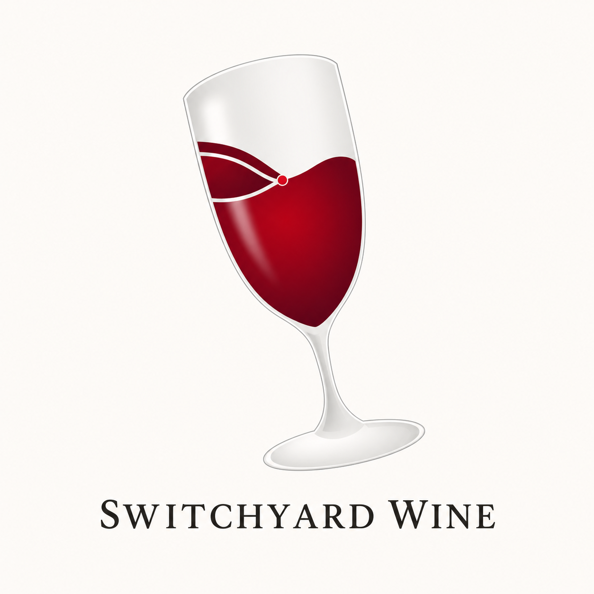
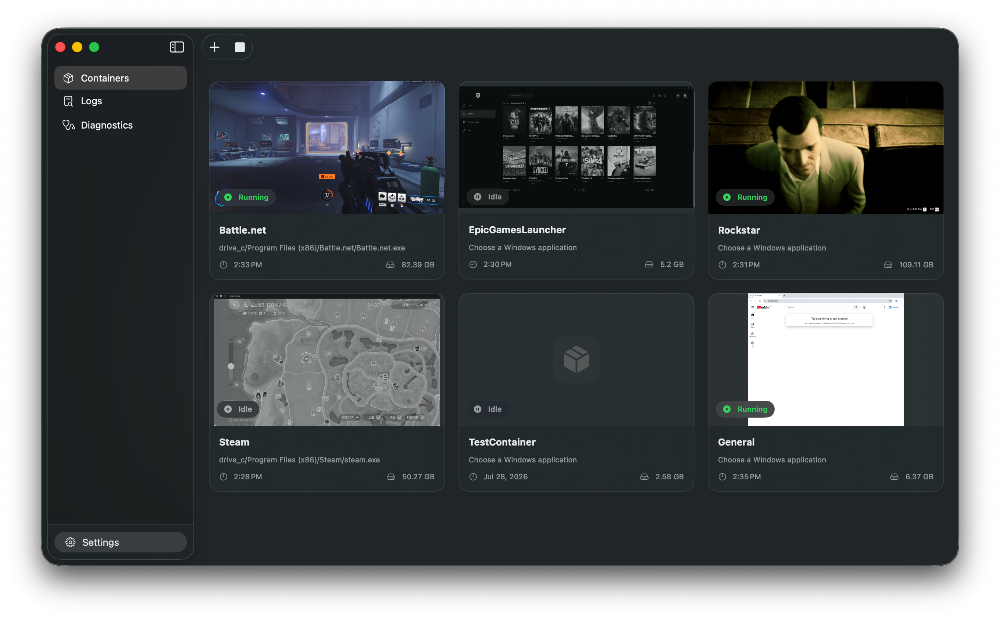
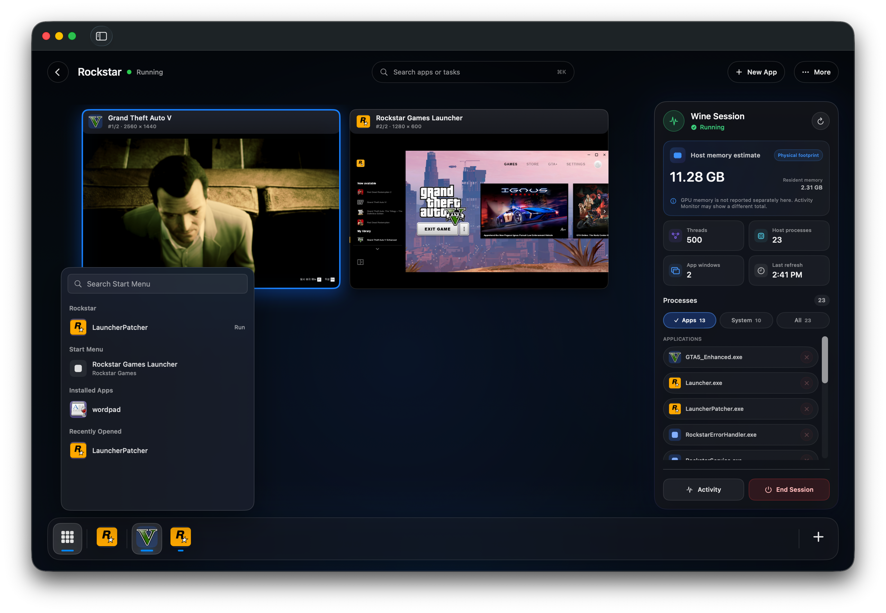

<p align="center">
  
</p>

# Switchyard Wine

[English](../../README.md) · [Muut kielet](../README.md#translations)

Switchyard Wine on [Switchyard](https://github.com/jungwuk-ryu/Switchyard) taustalla oleva Wine-runtime, jonka tehtävänä on hallita Windows-pelejä ja launchereita hallituissa säilöissä macOS-sovellukselle. Switchyard sovellus hallitsee käyttöliittymän, säilötilan ja runtime-valinnan; tämä arkisto hallitsee alla olevan Wine-koodin, build-putken ja yhteensopivuuskehityksen.

Projekti tekee tietoisesti rajatun kompromissin: se pysyy tunnetussa Wine-perustassa, kunnes Switchyardin vakiintuneita käyttötapauksia on validoitu, sen sijaan että päivitettäisiin joka kerta uuden Wine-version myötä. Jatkokehityksen muutokset ovat tavanomaisia, tarkastettavissa olevia Git-committeja kiinnitetyn WineHQ-revision päällä.

## Miksi tämä haara on olemassa

- **macOS-työ runtimessa.** Haara sisältää korjauksia Switchyardissa havaittuihin todellisiin vikapolkuihin,
  kuten D3DMetal callback/resource bridgingiin, macOS MSync-synkronointiin, Chromium/CEF-renderöintiin,
  grafiikkasuorittimen valintaan, mediatoistoon ja monikieliseen fonttivaihtoon.
- **Todennettava runtime-identiteetti.** Rakennusvaiheessa ulkoiset syötteet sidotaan ja hashataan, build tehdään aktiivisen runtimen ulkopuolella ja julkaistaan vasta varmennuksen jälkeen. Jokainen runtime kirjaa lähteen revision, riippuvuuksien tiivisteet, arkkitehtuurin ja ydinsovellusten hashit.
- **Regressiotestit mukana korjausten kanssa.** Repositorio testaa D3DMetalia, natiivikutsuja,
  MSyncia, Steam overlay hotpatchia, TLS:ää, mediaa, OpenGL:ää ja runtime-safety-polkuja,
  eikä tyydy onnistuneeseen käännökseen.
- **Yhteensopivuustiedot taustatiedoin.** Tulokset sisältävät tarkan runtime-version, macOS-hostin, grafiikkapolun, päivämäärän ja tunnetut rajoitteet; yhden asetelman tulosta ei pidetä universaalina tuena.

## MSIX ja paketoidut työpöytäsovellukset

Switchyard Wine sisältää `wineappx`- ja `appxsvc.dll`-komponentit allekirjoitettujen, salaamattomien desktop full-trust MSIX/AppX-pakettien käsittelyyn. Toteutettu elinkaari kattaa tarkistuksen, varmennetun purun, säilökohtaisen asennuksen ja päivityksen, poistamisen, palautuksen, roskakorin siivouksen sekä määriteltyjen Win32- tai WinUI 3 -sovellusten käynnistyksen pakettiidentiteetillä ja staattisilla riippuvuuksilla.

Tämä tarkoituksellisesti rajattu toiminnallisuus on kapeampi kuin Windowsissa. Kyseessä ei ole Microsoft Store -asiakas, UWP/AppContainer-tuki, allekirjoittamattoman paketin ohitus tai lupaus siitä, että kaikki Windows App SDK API:t toimivat. Täsmälliset pakettivaatimukset, komennot, kestävyysmalli ja nykyiset rajat ovat [MSIX-oppaassa](../msix.md).

## Käytössä

<p align="center">
  
</p>

<p align="center">
  
  <br>
  <sub>Grand Theft Auto V Enhanced ja Rockstar Games Launcher yhdessä hallitussa Wine-istunnossa.</sub>
</p>

## Hanki tai rakenna runtime

Switchyard-käyttäjät yleensä jättävät säilöt ja runtime-valinnan sovelluksen hallittavaksi. Allekirjoitetut ja
notarisoidut Wine-only-arkistot ovat saatavilla [GitHub Releases](https://github.com/jungwuk-ryu/switchyard-wine/releases)-sivulla. Apple Game Porting Toolkit on käyttäjän toimittama ohjelmisto, eikä kuulu tähän arkistoon tai sen julkaisuun.

Rakenna lähdekoodista Apple Silicon macOSissa:

```shell
./switchyard/verify_source.sh
./switchyard/build_runtime.sh
```

Lue [build-opas](../building.md) ennen runtime-version julkaisemista tai vaihtoa. Siinä käsitellään vaadittu toolchain, varmennetut riippuvuudet, staging, allekirjoitus, notarisointi ja käytettävissä olevat regressiotarkastukset.

## Dokumentaatio

- [Dokumentaatioindeksi](../README.md)
- [Arkkitehtuuri ja repositorion rajat](../architecture.md)
- [Runtimen rakentaminen ja julkaisu](../building.md)
- [MSIX ja paketoitu työpöytätuki](../msix.md)
- [Tallennetut sovellusyhteensopivuustiedot](../compatibility.md)
- [Lähteiden ja riippuvuuksien provenance](../provenance.md)
- [Unity-pelien vianmääritys](../troubleshooting-unity-games.md)

Yleiseen Wine-käyttöön ja kehitykseen käytä [WineHQ-dokumentaatiota](https://gitlab.winehq.org/wine/wine/-/wikis/home) ja [upstream-lähdettä](https://gitlab.winehq.org/wine/wine). Tämä README kuvaa Switchyard Wineä eikä toista upstream Wine-käsikirjaa.

## Yhteisö ja lisenssi

Liity [Switchyard Discordiin](https://discord.gg/USNfzUza7B) runtimetestien, yhteensopivuusraporttien ja kehityskeskustelun vuoksi.

Wine- ja Switchyard Wine -muutokset ovat lisensoitu LGPL-2.1-or-later; katso `LICENSE` ja `COPYING.LIB`. Switchyard Wine on riippumaton eikä sitä ole hyväksynyt WineHQ, Apple, Microsoft tai yllä näkyvät tuotteet.
